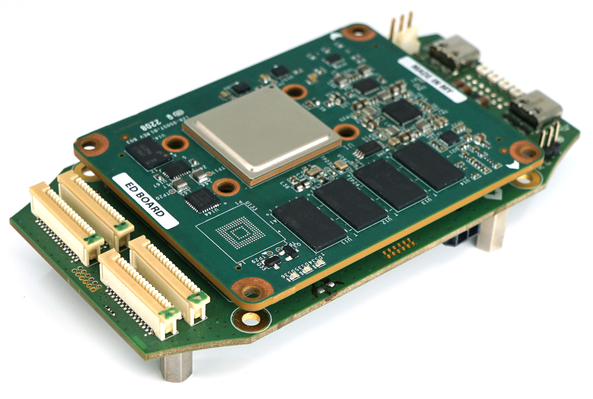

# FPGA Drone Hardware Manufacturing

## Off the shelf Hardware
The following hardware was used buildig the UAV:
- Frame: Chameleon OG 6" base plate (Armattan)
- Motors: 2306 2345kV Mr. Steele (Ethix)
- Motor Controller: BLHeli32-DS1200 (Hobbywing)
- RC receiver: FrSky XM PLUS Mini

## Baseboard
Baseboard for the SwiftEagle platform, requires a Xilinx Kria K26 SOM to work

Errata:
- USB3.0 lanes are switched (rx/tx and p/n), manual re-wiring possible

## IMU Board
IMU board attached to the baseboard, only the Bosch IMU is used in firmware, other sensors do not need to be mounted

Errata:
- none yet