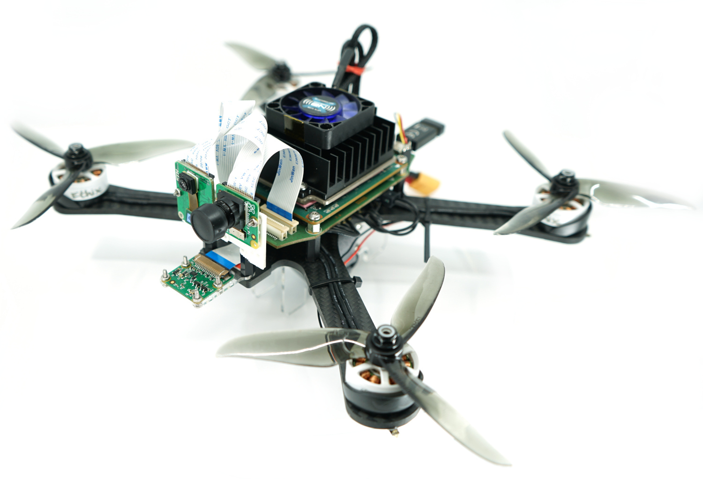

# SwiftEagle
This is the official code implementation to the paper:
SwiftEagle: An Advanced Open-Source, Miniaturized FPGA UAS Platform with Dual DVS/Frame Camera for Cutting-Edge Low-Latency Autonomous Algorithms



## Getting started
- Manufacture the hardware board
- Assemble parts of drone frame
- Synthesize the programmable logic (see local readme)
- Compile RPU firmware (see local readme)

## Bibtex

If this work is helpful for your research, please consider citing the following BibTeX entry.

```bibtex
@article{vogt2024IROS,
  title={SwiftEagle: An Advanced Open-Source, Miniaturized FPGA UAS Platform with Dual DVS/Frame Camera for Cutting-Edge Low-Latency Autonomous Algorithms},
  author={Vogt, Christian and Jost, Michael and Magno, Michele},
  booktitle={2024 IEEE/RSJ International Conference on Intelligent Robots and Systems (IROS)}, 
  year={2024}
}
```
